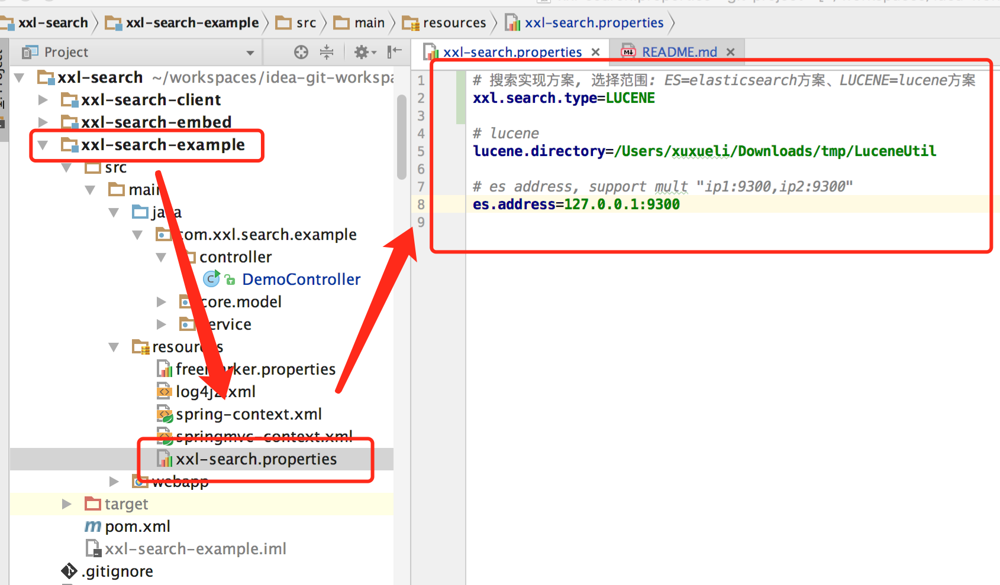
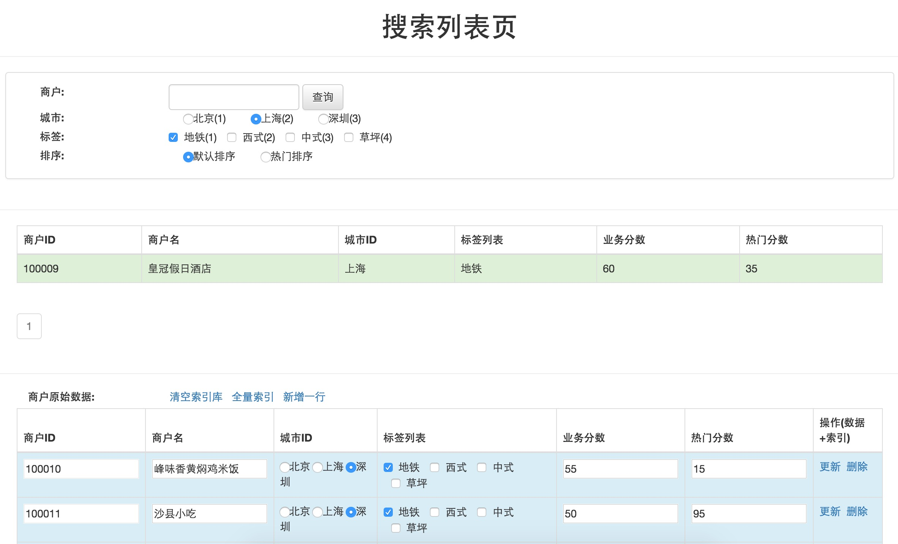
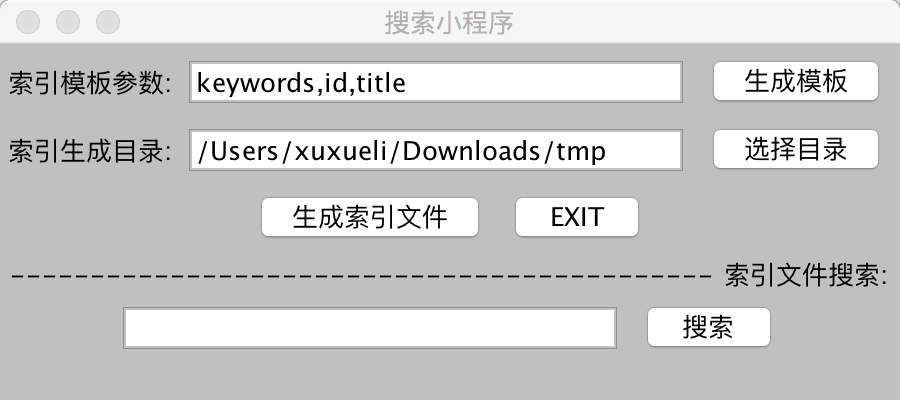
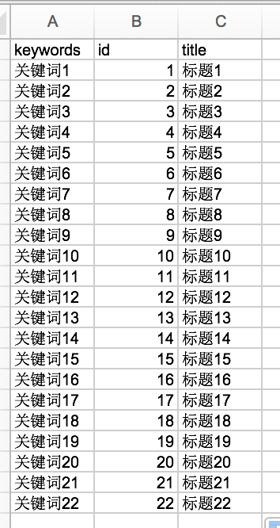
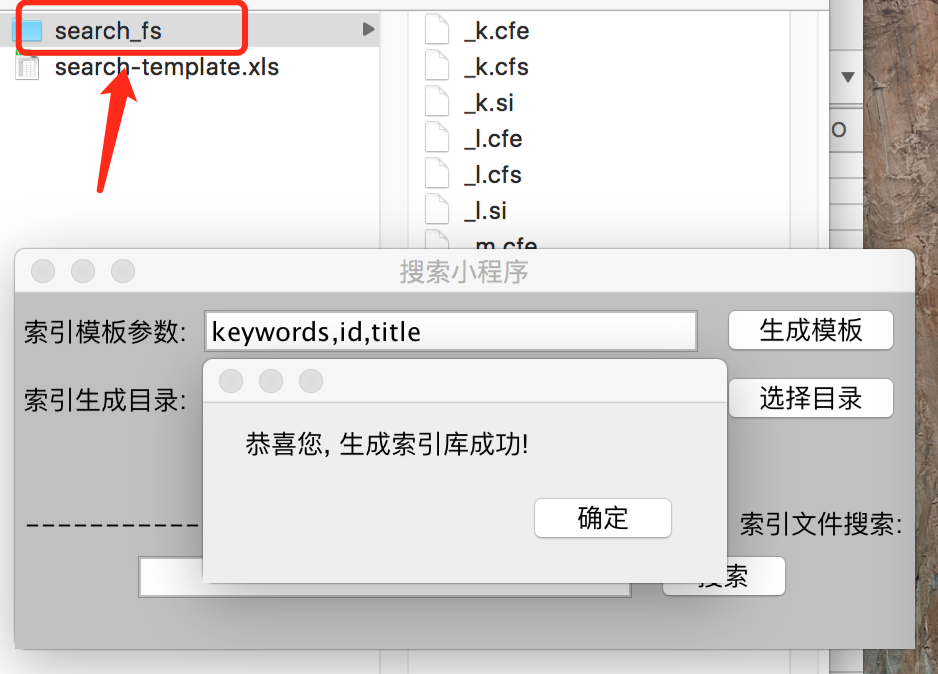
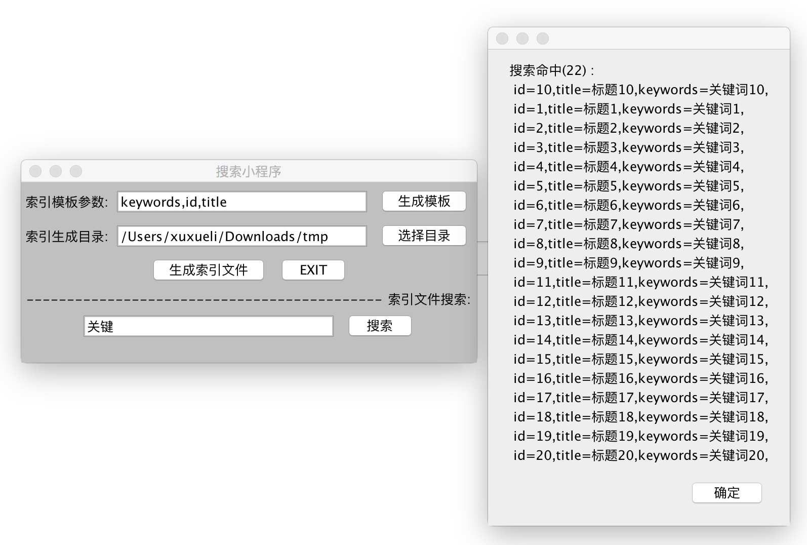

## 《搜索应用参考示例XXL-SEARCH》

[](https://github.com/xuxueli/xxl-search/releases)
[](http://www.gnu.org/licenses/gpl-3.0.html)
[](https://www.xuxueli.com/page/donate.html)

## 一、简介

### 1.1 概述
XXL-SEARCH 是以 "lucene/elasticsearch" 为核心的，Pragmatic风格的搜索应用参考示例，是索引搜索世界中的主流技术选型，最佳实践的总结与演示。

### 1.2 特性
- 1、Quickstart：一个完整的 "搜索列表页" 演示应用，演示搜索的开发和使用的完整流程。

	《演示功能列表》
		- 1、新增一条索引:
			- 索引字段支持 "排序"
			- 索引字段支持 "分词";
			- 一个Field支持索引绑定多个值, 实现一对多索引List功能; 比如在商户打标签时, 可以给一个商户打上多个标签;
		- 2、更新一条索引
		- 3、删除一条索引
		- 4、清空索引
		- 5、查询:
			- 精确查询: 根据绑定的索引, 进行精确查询;
			- 分词查询: 通过分词, 进行模糊查询;
			- 范围查询: 针对同一个字段, 支持在指定区间内查询;
			- 关联查询: 针对不同字段, 支持多字段关联查询;
			- 分页: 支持分页功能;
			- 排序: 支持排序功能;

- 2、多种方案：目前演示项目, 基于 "lucene、elasticsearch" 两种方案分别进行演示了开发流程。
- 3、"搜索小程序", 基于Lucene实现, 可以生成 "索引库文件", copy该文件至任何系统, 可嵌入式的增加系统的搜索功能;

### 1.3 下载

#### 源码仓库地址

源码仓库地址 | Release Download
--- | ---
[https://github.com/xuxueli/xxl-search](https://github.com/xuxueli/xxl-search) | [Download](https://github.com/xuxueli/xxl-search/releases)
[https://gitee.com/xuxueli0323/xxl-search](https://gitee.com/xuxueli0323/xxl-search) | [Download](https://gitee.com/xuxueli0323/xxl-search/releases)  


#### 技术交流
- [社区交流](https://www.xuxueli.com/page/community.html)

### 1.4 环境
- Maven3+
- Jdk1.7+
- Tomcat7+

- Lucene5+
- Elasticsearch2+


## 二、用例演示

### 源码目录介绍

    - /xxl-search-client    : "xxl-search-example" 依赖的搜索核心包, 内置lucene、elasticsearch 两种搜索实现方案;
    - /xxl-search-example   : "搜索列表页" 演示项目, 基于 "xxl-search-client" 实现;
    - /xxl-search-embed     : "搜索小程序" 项目, 基于Lucene实现, 可以生成 "索引库文件", copy该文件至任何系统, 可嵌入式的增加系统的搜索功能;

主要包括下面两个项目:

- 1、"搜索列表页" 演示项目 ("xxl-search-client" 和 "xxl-search-example" 组成);

>示例以一个完整的 "搜索列表页" 应用展开，可以覆盖大部分搜索列表开发需求。搜索列表需求互联网互联网公司非常常见, 如 "淘宝的商品搜索列表页"、"京东的商户搜索列表页" 和 "安居客的房产搜索列表页" 等;

- 2、"搜索小程序" 项目 ("xxl-search-embed" 组成);

>基于Lucene实现, 可以生成 "索引库文件", copy该文件至任何系统, 可嵌入式的增加系统的搜索功能;

### 1、"搜索列表页" 演示项目

见项目 "xxl-search-example"

- 1、设置搜索方案



目前, 针对 "搜索列表页" 的演示项目, 已经内置实现两种搜索方案, 通过上图参数 "xxl.search.type" 配置:

    ES : 基于elasticsearch的方案, 依赖elasticsearch集群, 天然支持分布式;
    LUCENE : 基于lucene的方案, 不依赖第三方服务, 但是原生lucene开发不支持分布式;

- 2、配置 "lucene"方案 的索引目录 (搜索方案选择为 LUCENE 时有效) 

如上图, 设置参数 "lucene.directory" 的值为指定磁盘目录即可;

- 3、配置 "elasticsearch"方案 的集群地址 (搜索方案选择为 ES 时有效)

如上图, 设置参数 "es.address" 的值为elasticsearch的集群地址即可, 地址格式为 "ip1:port,ip2:port" ;

- 4、部署并访问 "搜索列表页"
 
部署 "xxl-search-example" 项目, 访问项目跟地址即可:
 


从上图可知, 演示界面主要分为两个区域:

    搜索区域: 即页面上方的 "条件筛选区域" 和 "搜索列表区域", 提供对索引数据的查询;
    原始数据区域: 即页面下方 "商户原始数据" 列表区域, 提供对索引数据的 CRUD 功能; 

"搜索列表页" 演示页面功能介绍:

    操作操作相关:
        1、"清空索引库" 按钮: 清空全部索引数据;
        2、"全量索引" 按钮: 以 "商户原始数据" 列表中数据为基础 , 进行全量索引;
        3、"新增一行" 按钮: 在 "商户原始数据" 列表下新增一行, 完善数据后点击 "保存" 按钮, 可新增一条索引数据;
        4、"更新" 按钮: 在 "商户原始数据" 列表中每条记录右侧, 点击后将会更新该条数据对应的索引;
        5、"删除" 按钮: 在 "商户原始数据" 列表中每条记录右侧, 点击后将会删除该条数据对应的索引;
    索引查询相关:
        1、"商户" 输入框: 将会分词查询匹配的商户;
        2、"城市" 单选框: 将会查询对应城市下的商户;
        3、"标签" 复选框: 将会跟选中标签绑定的商户;
        4、"排序" 单选框: 将会选中排序字段进行商户排序;

### 2、"搜索小程序" 项目

见项目 "xxl-search-example" 

注意: 分词器使用了 "IKAnalyzer", 需要确保本地maven仓库中已经存在 "IKAnalyzer" 依赖。项目中已经提供了最新版本的 "IKAnalyzer" ,见路径 "xxl-search/xxl-search-embed/src/test/resources/IKAnalyzer-5.3.0.jar"

1、运行进入主界面:

该项目是一个JAR项目, 主方法为: com.xxl.search.embed.Application , 运行可查看主界面如下:



2、配置 "索引模板参数", 生成索引模板 :

上图中 "索引模板参数" 输入框中, 可以输入多个参数, 定制索引模板。

多个参数用逗号 "," 分隔, 必须报刊参数 "keywords", 该参数对应的数据将会被索引分词, 可通过下面搜索框搜索;

点击 "生成模板" 按钮, 将会在 "索引生成目录" 输入框对应的目录下, 生成索引模板, 索引模板是一个 excel表格, 如下图所示:


3、根据索引模板, 填充索引数据 :



4、生成索引文件:

点击 "生成索引文件" 按钮, 将会根据索引模板中的数据, 在 "索引生成目录" 下的 "search_fs" 目录中生成索引文件, 如下图:



5、索引查询:

在最下方的 "搜索" 输入框中输入关键字, 点击右侧的 "搜索" 按钮, 即可在索引文件中进行分词搜索, 关键词和索引模板中的参数 "keywords" 进行分词匹配:



可通过一下命令, 将项目打包成JAR包:
```
// package jar witch lib
mvn dependency:copy-dependencies -DoutputDirectory=lib   -DincludeScope=compile
```

## 三、技术实现

### Lucene & Elasticsearch


## 四、历史版本
### 1.2 特性
- 1、Quickstart：一个完整的 "搜索列表页" 演示应用，演示搜索的开发和使用的完整流程。

	《演示功能列表》
		- 1、新增一条索引:
			- 索引字段支持 "排序"
			- 索引字段支持 "分词";
			- 一个Field支持索引绑定多个值, 实现一对多索引List功能; 比如在商户打标签时, 可以给一个商户打上多个标签;
		- 2、更新一条索引
		- 3、删除一条索引
		- 4、清空索引
		- 5、查询:
			- 精确查询: 根据绑定的索引, 进行精确查询;
			- 分词查询: 通过分词, 进行模糊查询;
			- 范围查询: 针对同一个字段, 支持在指定区间内查询;
			- 关联查询: 针对不同字段, 支持多字段关联查询;
			- 分页: 支持分页功能;
			- 排序: 支持排序功能;

- 2、多种方案：目前演示项目, 基于 "lucene、elasticsearch" 两种方案分别进行演示了开发流程。
- 3、"搜索小程序", 基于Lucene实现, 可以生成 "索引库文件", copy该文件至任何系统, 可嵌入式的增加系统的搜索功能;

### TODO
- 1、新增 solr 搜索方案;
- 2、新增 IK 等分词器支持;
- 3、底层API封装优化;

## 五、其他

### 5.1 项目贡献
欢迎参与项目贡献！比如提交PR修复一个bug，或者新建 [Issue](https://github.com/xuxueli/xxl-search/issues/) 讨论新特性或者变更。

### 5.2 开源协议和版权
产品开源免费，并且将持续提供免费的社区技术支持。个人或企业内部可自由的接入和使用。

- Licensed under the GNU General Public License (GPL) v3.
- Copyright (c) 2015-present, xuxueli.

---
### 捐赠
无论金额多少都足够表达您这份心意，非常感谢 ：）      [前往捐赠](https://www.xuxueli.com/page/donate.html )
