## 《面向对象的WebAPI框架XXL-HEX》

## 一、简介

### 1.1 概述
XXL-HEX 是一个简单易用的WebAPI框架, 拥有 "面向对象、数据加密、跨语言" 的特点。目标是: 提高Web API (如 Android、IOS 等APP接口, 或者 unity3d 等游戏服务端接口) 的开发体验以及开发效率。现已开放源代码，开箱即用。

### 1.2 特性
- 1、面向对象: 一个API接口对应 "一个Handler" 和 "Requset对象/Response对象"; 针对Web API开发 (如 Android、IOS 等APP接口开发, 或者 unity3d 等游戏接口开发), 采用面向对象的思维去开发 Web API接口。提高API接口的开发效率以及开发体验;
- 2、数据加密: 通讯数据以16进制数据的形式存在, 数据天然加密; 同时, 底层为API接口预留了API校验接口, 可方便的扩展数据加密逻辑, 进一步校验数据安全性;
- 3、跨语言: 一个API接口, 开发一次, 支持任何语言调用(系统开放底层通信协议, 任何语言可灵活定制自己语言的Client端实现), 无论Client端是Android、IOS、C#开发的U3D游戏等等;

### 1.3 背景

**面向对象**

当我们为APP(安卓、IOS等)开发API接口时, 我们可能采用类似 RESTFUL 等方案, 但是此时API接口请求参数和响应数据比较零散, 需要针对多个参数进行繁琐的参数获取赋值等操作, 维护和使用比较繁琐。

因此, 我们考虑上述Web API接口是否可以换一种面向对象的开发方式。在新系统中, 开发每一个API接口需要定义一个Handler类, 同时绑定Request对象和Response对象, 系统底层会自动把请求对象赋值给Request对象, 我们只需要调用Request对象中属性值即可。同样的, 我们只需要把响应数据赋值给Response对象即可; 自此, API接口的开发效率和开发体验将会大幅度提升; 

**数据加密**

常规API接口服务数据以明文格式存在, 数据易暴露业务信息, 如遭遇恶意爬虫或者DDOS攻击, 轻则加重服务器负担, 服务器处理了外部非法的接口请求; 重则篡改线上业务数据, 造成严重后果。

XXL-HEX 的API接口通讯数据以HEX的格式存在, 天然加密, 安全性相对较高。初次之外, 支持自由扩展API接口的校验逻辑, 进一步校验数据安全性, 提高体统的整体安全性;

**跨语言**

当我们提供API接口, 调用方千差万别, 如下:

- 1、Android (java)
- 2、IOS (object-c)
- 3、J2EE
- 4、PHP Web
- 5、.NET 
- 6、unity3d (C#)
- 7、PC客户端 (C++)

存在如此多的异构系统的情形下, 一种跨语言的 API 通讯方案显得尤为重要。

如果简单实现跨语言则 RESTFUL 等方案可简单实现, 但是如若要兼容上述 "面向对象" 和 "数据加密" 的特点, 同时保证系统简易且稳定则存在一定难度。XXL-HEX得益于其基于HEX的特性以及底层特殊数据结构, 在保证兼容上述特性的技术上, 天然支持跨语言。

### 1.4 下载

#### 源码仓库地址

源码仓库地址 | Release Download
--- | ---
[https://github.com/xuxueli/xxl-hex](https://github.com/xuxueli/xxl-hex) | [Download](https://github.com/xuxueli/xxl-hex/releases)
[https://gitee.com/xuxueli0323/xxl-hex](https://gitee.com/xuxueli0323/xxl-hex) | [Download](https://gitee.com/xuxueli0323/xxl-hex/releases)  

#### 技术交流
- [社区交流](https://www.xuxueli.com/page/community.html)

### 1.5 环境
- Maven3+
- Jdk1.7+
- Tomcat7+

## 二、总体设计

### 2.1 架构图

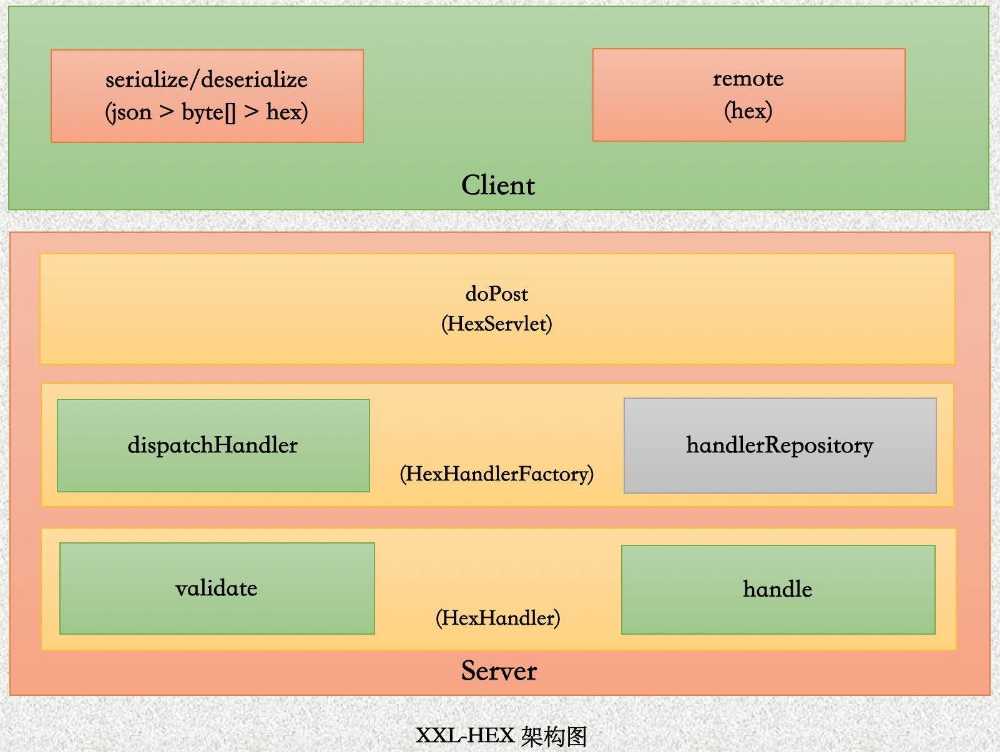

XXL-HEX作为一个API接口实现方案, 是个典型的CS模型。

Server端只要由以下三个组件组成:

- 1、HexServlet: 服务端API接口的统一入口, 承担API接口请求的路由功能; 
- 2、HexHandlerFactory: 服务端核心组件, 负责API接口请求的 "dispatch", 以及消息的编解码以及序列化; 同时作为Handler仓库, 汇总并维护服务端可用业务Handler;
- 3、HexHandler: API接口以HexHandler的形式存在。开发人员开发具体业务Handler时, 需要实现 "validate" 和 "handle" 接口, 前者负责业务校验, 后者执行具体的业务逻辑;

Client端主要由两个模块组成:

- 1、serialize/desecrialize: 负责对消息对象序列化以及编解码操作, 生成服务端可识别的hex消息;
- 2、remote: 负责和Server端之间的消息通信, 消息体为hex格式数据;

### 2.2 "一次API接口请求时序图" 分析

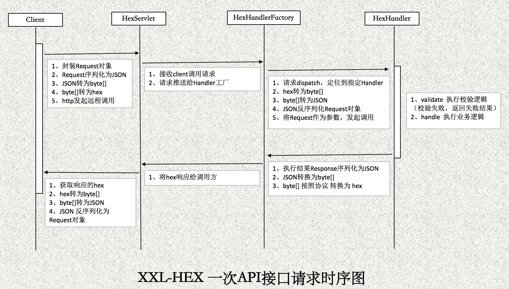

从上图可知, 一次API请求过程所经历的流程为:

- 1、Client端创建Request消息对象;
- 2、Request消息对象, 转换为 "HEX格式Request消息" (Server端只会识别HEX格式消息), POST发送到Server端;
- 3、HexServlet路由组件, 接收API请求, 将请求发送给HexHandlerFactory组件;
- 4、HexHandlerFactory负责解码 "HEX格式Request消息", 并反序列化为Request对象, 然后将API请求dispatch到指定的业务Handler上;
- 5、业务Handler首先会根据Request对象进行validate校验, 校验成功则执行业务handle方法, 执行具体的业务逻辑;
- 6、业务handle执行结束, 封装执行结果为Response对象;
- 7、HexHandlerFactory组件负责将Response对象序列化, 然后编码为 "HEX格式Response消息", 返回给HexServlet路由;
- 8、HexServlet路由组件, 响应 "HEX格式Response消息" 消息给Client端。Finish。

### 2.3 "消息体结构(HEX数据结构)" 设计

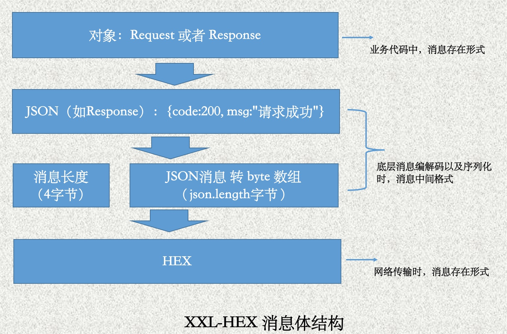

网络传输时, 请求响应数据以HEX(16进制字符串)的格式存在。HEX格式消息的数据来源如下 (以将请求参数转换为HEX为例) :

- 第一步: 封装 "Request对象" (不同开发语言, 对象可能不同, 这一步仅仅针对Java语言, 如其余开发语言实现Client, 可直接跳到 "第二步" ) 
- 第二步: 将 "Request对象" 序列化为 "JSON字符串" ; (JSON属性, 应该可服务端Request对象属性保持一致)
- 第三步: 将 "JSON字符串" 转换为 "特殊格式" 的 字节数据 "byte[]", "byte[]" 的组成:  "JSON字符串"长度(4字节) + "JSON字符串"字节内容;
- 第四步: 将 "byte[]" 转换为 HEX 数据。 Finish。

至此, 已经生成了服务端可以识别的HEX数据。至于服务端返回的HEX格式数据的解析, 安装上述步骤逆序操作即可。

## 三、快速入门

### 3.1 服务端配置和开发

- 1、配置maven依赖

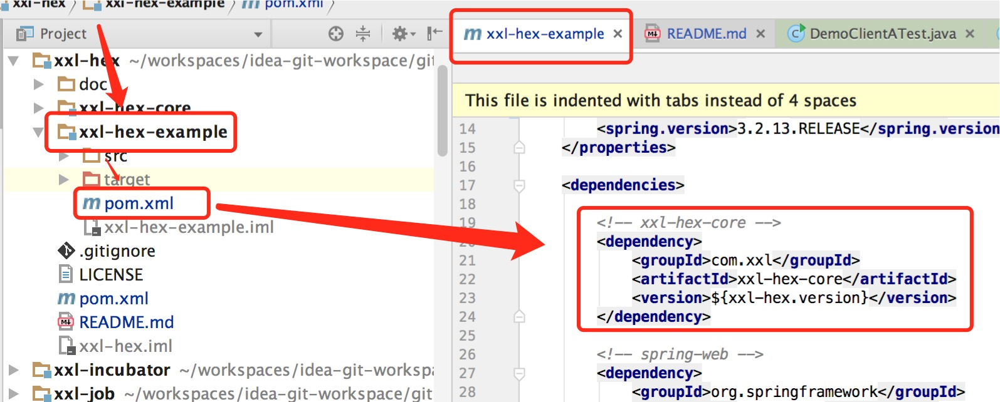

- 2、配置HexHandler路由入口

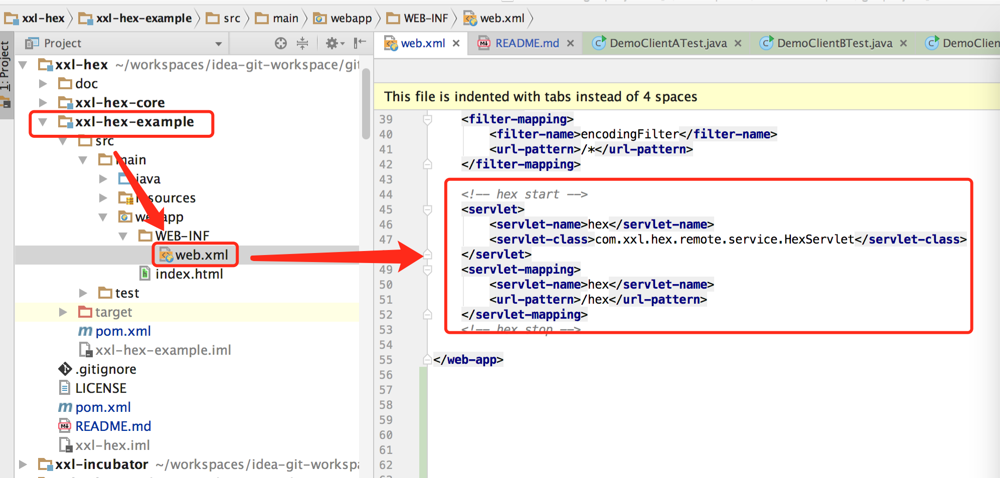

- 3、配置HexHandler工厂, 并配置HexHandler扫描路径

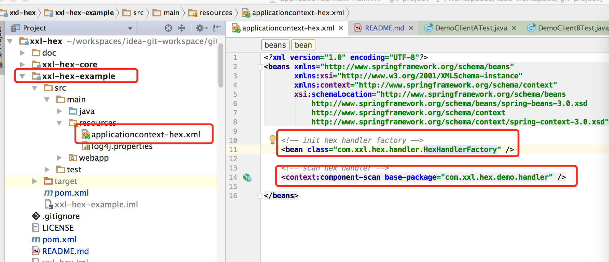

- 4、开发第一个API接口 (可参考下面Demo示例, 进行理解和学习)

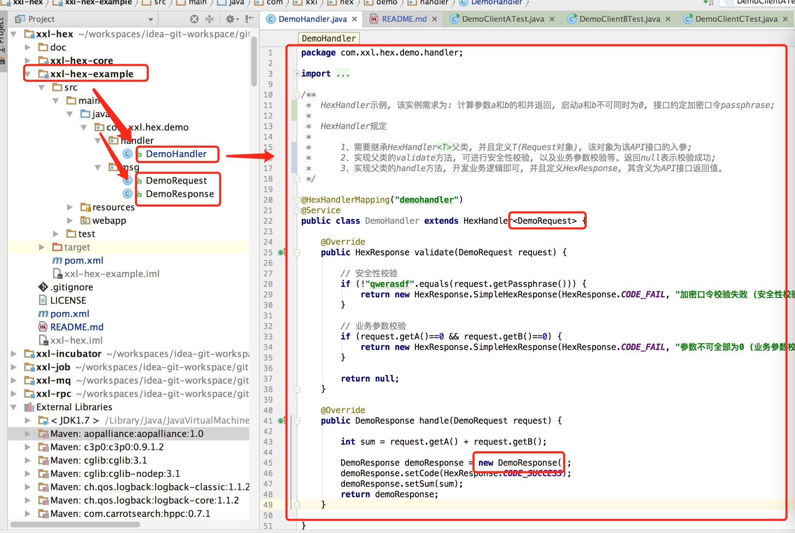

每个API接口, 由三部分组成: HexHandler + Request + HexResponse

开发HexHandler流程:

    1、需要继承HexHandler<T>父类, 并且定义T(Request对象), 该对象为该API接口的入参;
    2、实现父类的validate方法, 可进行安全性校验, 以及业务参数校验等。返回null表示校验成功;
    3、实现父类的handle方法, 开发业务逻辑即可, 并且定义HexResponse, 其含义为API接口返回值。
    4、新增Spring注解	 "@Service", 用于方便的注入Spring容器中其余服务; 新增 "@HexHandlerMapping" 注解, 注解value值为该API接口的唯一标示, Client端调用时将会使用到;

开发Request流程: 创建普通Java类即可

开发HexResponse流程:

    1、需要继承HexResponse父类
    2、需要实现Serializable接口

访问地址 http://localhost:8080/hex 可查看在提供服务的的API接口

### 3.2 客户端开发 (可参考提供的三种Client调用Demo, 进行理解和学习，并定制其他版本Client端实现)

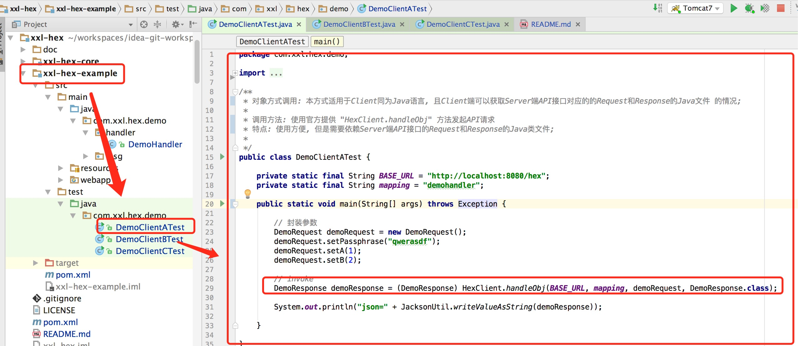

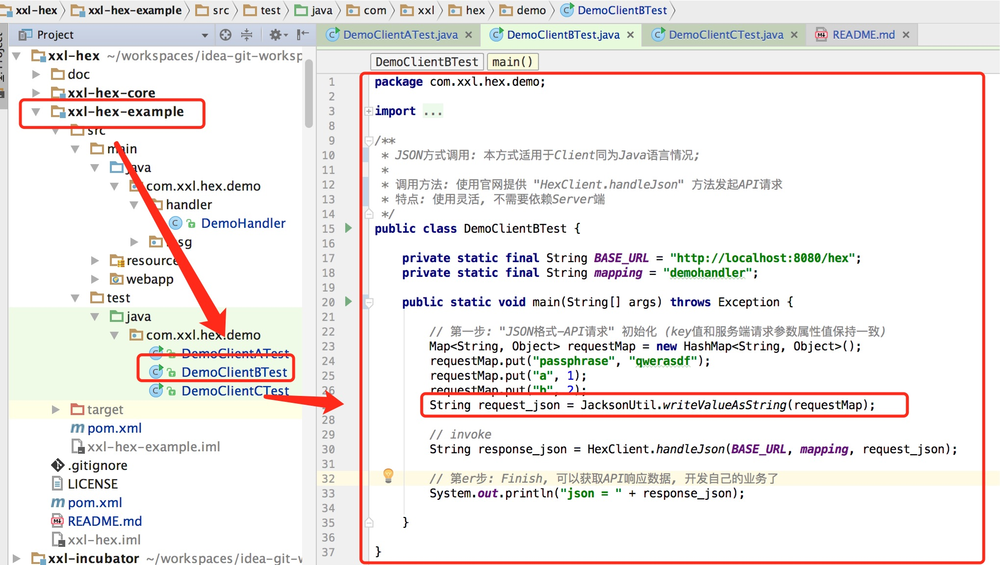

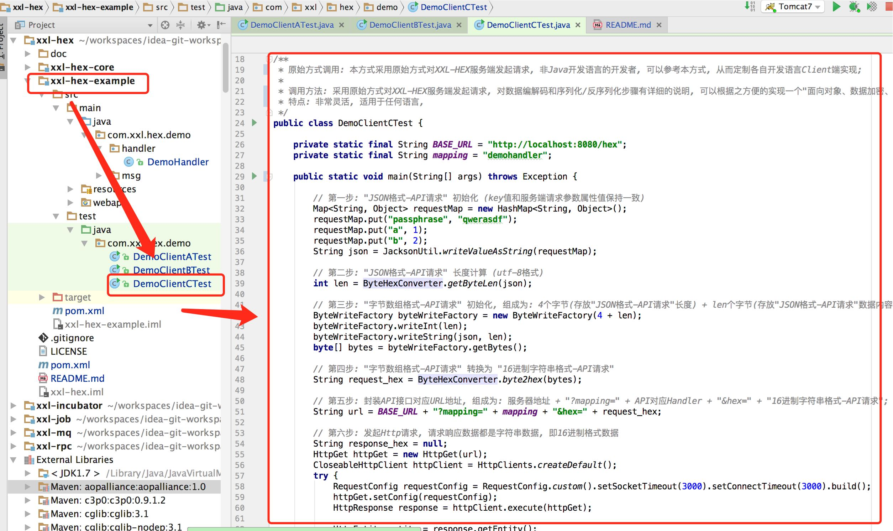

三种Client调用Demo说明:

- 1、对象方式调用: 本方式适用于Client同为Java语言, 且Client端可以获取Server端API接口对应的的Request和Response的Java文件 的情况;
    - 调用方法: 使用官方提供 "HexClient.handleObj" 方法发起API请求
    - 特点: 使用方便, 但是需要依赖Server端API接口的Request和Response的Java类文件;
- 2、JSON方式调用: 适用于Client同为Java语言情况;
    - 调用方法: 使用官网提供 "HexClient.handleJson" 方法发起API请求
    - 特点: 使用灵活, 不需要依赖Server端
- 3、原始方式调用: 本方式采用原始方式对XXL-HEX服务端发起请求, 非Java开发语言的开发者, 可以参考本方式, 从而定制各自开发语言Client端实现;
    - 调用方法: 采用原始方式对XXL-HEX服务端发起请求, 对数据编解码和序列化/反序列化步骤有详细的说明
    - 特点: 非常灵活, 跨语言。可以根据本方式示例方便的实现一个"面向对象、数据加密、跨语言"的API接口Client端;

### 3.3 JS版本客户端开发

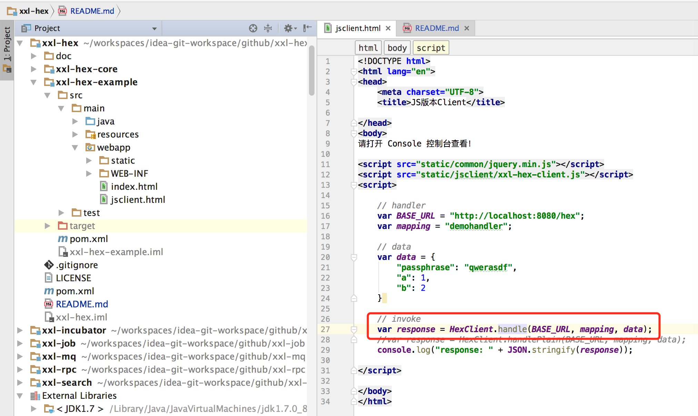

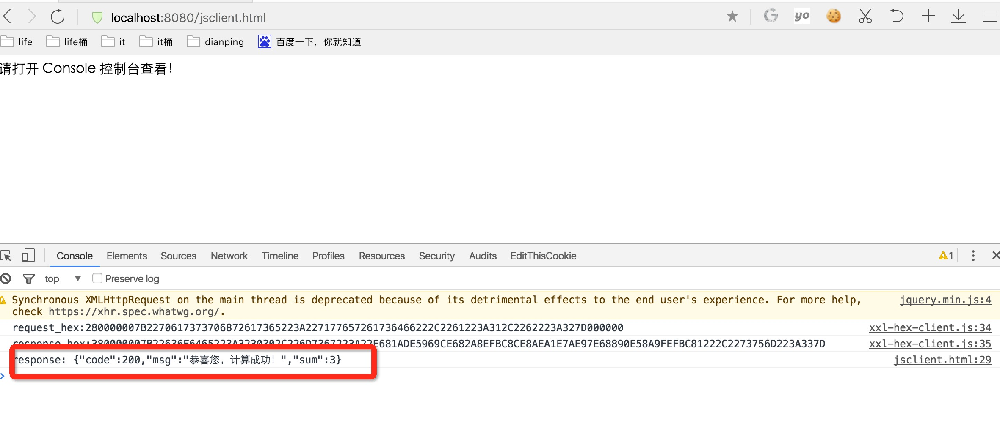

系统已经提供了JavaScript版本的Client端实现，调用DemoHandler的JS代码如上图，简单易用。接入之后，底层数据通讯将会以HEX加密串的形式进行数据传输。

首先，提供系统的安全性；其次，API接口一次开发，可以多次复用，无论开发语言是Java、OC、C#、JS等等；而且，API服务端可采用面向对象的方式进行API接口开发，提供开发效率和体验；

让API接口拥有 "面向对象、数据加密、跨语言" 的特点。

## 四、历史版本
### 4.1 版本1.1.0新特性
- 1、面向对象: 一个API接口对应 "一个Handler" 和 "Requset对象/Response对象"; 针对Web API开发 (如 Android、IOS 等APP接口开发, 或者 unity3d 等游戏接口开发), 采用面向对象的思维去开发 Web API接口。提高API接口的开发效率以及开发体验;
- 2、数据加密: 通讯数据以16进制数据的形式存在, 数据天然加密; 同时, 底层为API接口预留了API校验接口, 可方便的扩展数据加密逻辑, 进一步校验数据安全性;
- 3、跨语言: 一个API接口, 开发一次, 支持任何语言调用(系统开放底层通信协议, 任何语言可灵活定制自己语言的Client端实现), 无论Client端是Android、IOS、C#开发的U3D游戏等等;

### 4.2 版本1.2.0新特性
- 1、Client端，新增Javascript版本实现：示例文件见 "xxl-hex/xxl-hex-example/src/main/webapp/jsclient.html"，启动 "xxl-hex-example" 项目访问即可；
- 2、Server端，新增明文模式：如果系统不需要Hex加密特性，可选择明文数据传输方案；

### TODO
- WebAPI之家：可通过界面查看登记的API列表，支持API管理，支持Mock调用等；
- 服务端在线MOCK功能实现(支持通过浏览器访问 http://项目地址/hex 查看可提供服务的所有业务API接口, 同时可在线MOCK接口调用);
- "xxl-hex-core" 推送maven中央仓库

## 五、其他

### 5.1 项目贡献
欢迎参与项目贡献！比如提交PR修复一个bug，或者新建 [Issue](https://github.com/xuxueli/xxl-hex/issues/) 讨论新特性或者变更。

### 5.2 用户接入登记
更多接入的公司，欢迎在 [登记地址](https://github.com/xuxueli/xxl-hex/issues/1 ) 登记，登记仅仅为了产品推广。

### 5.3 开源协议和版权
产品开源免费，并且将持续提供免费的社区技术支持。个人或企业内部可自由的接入和使用。

- Licensed under the GNU General Public License (GPL) v3.
- Copyright (c) 2015-present, xuxueli.

---
### 捐赠
无论金额多少都足够表达您这份心意，非常感谢 ：）      [前往捐赠](https://www.xuxueli.com/page/donate.html )
